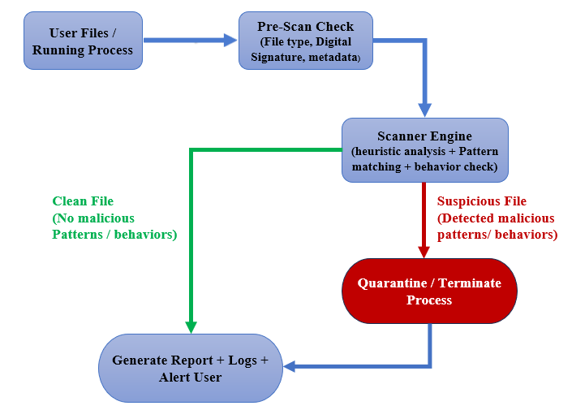
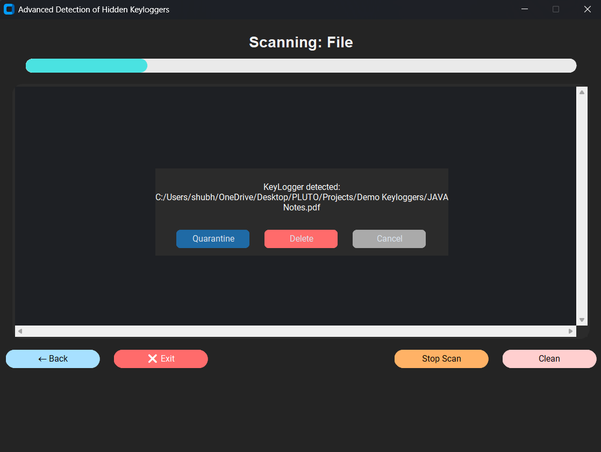

# 🔐 Advanced Detection of Hidden Keyloggers

**A lightweight Python-powered scanner to detect and flag hidden keyloggers through file, folder, and process analysis.**

 
 


## 📝 Overview

Keyloggers are one of the most common forms of malicious software, silently recording user keystrokes to steal sensitive information such as passwords, banking details, and personal messages. Many of these threats remain hidden inside files, folders, or running processes, making them difficult for regular users to identify.

**Advanced Detection of Hidden Keyloggers** is a Python-powered security tool designed to address this problem.  
It provides a **lightweight, GUI-based scanner** that analyzes files, directories, and system processes using **hash-based integrity checks and anomaly detection** to flag suspicious activity.

This project is built for **educational and research purposes**, making the detection of keyloggers more accessible while helping users and learners understand how such threats can be identified.

## ✨ Features

🔹 **High-Priority Features (Core)**  
- 🗂 **File Scanner** – Scan individual files and check against a JSON-based detection database.  
- 📂 **Folder Scanner** – Recursively analyze entire directories for hidden keyloggers.  
- ⚙️ **Process Monitor** – Collect running system processes and compare them with the baseline JSON reference.  
- 📝 **Logging System** – Generates detailed logs of scan results for future analysis and audits.  
- 🖥 **Interactive GUI** – User-friendly interface built with `Tkinter`  `CustomTkinter` and `PyQt5`.  

🔹 **Medium-Priority Features (Enhanced UX)**  
- ⏹ **Cancel Scan Button** – Stop scanning at any time.  
- ❌ **Exit Button on Pages** – Quick exit option with clear "X" indicator.  
- 📊 **Scan Results Display** – Organized and readable results inside the GUI.  
- 🔄 **Threaded Scanning** – Keeps the app responsive while scans run in the background.  

🔹 **Future-Ready Features (Planned)**  
- 🤖 **AI/Heuristic Detection** – Smarter detection of unknown or modified keyloggers.  
- 🔔 **Real-Time Alerts** – Continuous monitoring with instant notifications.  
- 🌐 **Cross-Platform Builds** – Windows, Linux, and macOS support.

## 🏗 Architecture & Detection Method

The project follows a **multi-stage detection workflow**:

1. **Input Stage**  
   - User selects files, folders, or running processes for scanning.  

2. **Pre-Scan Check**  
   - Collects metadata such as file type, digital signatures, and basic attributes.  

3. **Scanner Engine**  
   - Uses **heuristic analysis, pattern matching, and behavior checks**.  
   - Detects suspicious characteristics like keylogger APIs, persistence techniques, or unusual behavior.  

4. **Decision Point**  
   - **Clean File / Process** → Marked safe, logged, and reported.  
   - **Suspicious File / Process** → Quarantined or terminated, flagged in logs.  

5. **Reporting & Logging**  
   - Generates reports with scan details, timestamps, and actions taken.  
   - Alerts the user through the GUI and stores results for future analysis.  

📌 **Architecture :**  



## 🛠 Tech Stack & Requirements

### ⚙️ Tech Stack
- **Python 3.10+** → Core programming language
- **CustomTkinter** → Modern & responsive GUI framework
- **Tkinter** → Base GUI elements
- **Threading** → For non-blocking scanning operations
- **JSON** → Used for storing IOCs (Indicators of Compromise) & configuration
- **Logging Module** → For structured log generation & reporting
- **OS & Sys Modules** → System-level operations (process, file handling, etc.)

---

### 📋 Requirements
- **Operating System**: Windows 10/11 (primary target)  
- **Python**: Version 3.10 or above  
- **Pip Packages** (install via `pip install -r requirements.txt`):
  - `PyPDF2`
  - `Pillow`
  - `customtkinter`
  - `PyQt5`

---

### 🔧 Installation

It is recommended to use a **virtual environment (venv)** for clean dependency management.

1. Clone the repository:
   ```bash
   git clone https://github.com/your-username/Anti-KeyLogger.git
   cd Anti-KeyLogger

2. Setup Virtual Environment:
   ```bash
   python -m venv venv

3. Activate the environment:
   Windows:
   ```bash
      .\venv\Scripts\activate
   ```
   Linux/Mac:
      ```bash
      source venv/bin/activate

3. Install dependencies:
   ```bash
   pip install -r requirements.txt

4. Run the application:
   ```bash
   python main.py


### 🖥️ Optional: Build Executable (Windows)
If you want to create a standalone .exe:
   ```bash
   pip install pyinstaller
   pyinstaller.exe --onefile --windowed --icon=.\Assets\KeyDefender.ico --name KeyDefender --add-data "database/images/background.png;database/images" main.py
```
The executable will be available inside the dist/ folder.


## 🚀 Usage

### GUI Flow
1. **Launch the application** → GUI opens with main menu.  
2. **Choose scan option**:
   - **File Scan** → Select specific file/folder.  
   - **Process Scan** → Scan running processes (uses `ioc.json` for indicators).  
   - **Exit** → Close application.  

3. **Scan Results**:
   - Displays **Clean / Suspicious** status.  
   - Option to quarantine, Delete/terminate malicious process.  
   - Results saved to log file.  

📸 **Example Scan Result :**  


---

### 📜 Sample Logs
Logs are stored in `database/logs/scan_logs.txt`:
   ```logs
   2025-09-19 14:01:27 → C:/Users/shubh/OneDrive/Desktop/PLUTO/Projects/Demo Keyloggers/JAVA Notes.pdf → Keylogger Detected (43 suspicious patterns)
   2025-09-19 14:01:29 → C:/Users/shubh/OneDrive/Desktop/PLUTO/Projects/Demo Keyloggers/Keylogger.py → Keylogger Detected (17 suspicious patterns)
   2025-09-19 14:01:31 → C:/Users/shubh/OneDrive/Desktop/PLUTO/Projects/Demo Keyloggers/Normal ..png → Keylogger Detected (20 suspicious patterns)
   2025-09-19 14:01:34 → C:/Users/shubh/OneDrive/Desktop/PLUTO/Projects/Demo Keyloggers/VisualStudi0Setup..exe → Keylogger Detected (32 suspicious patterns)
   2025-09-19 14:01:34 → C:\Users\shubh\OneDrive\Desktop\PLUTO\Projects\Demo Keyloggers\zip.zip → main.py → Keylogger Detected (17 suspicious patterns)
   2025-09-19 14:02:07 → C:/Users/shubh/Downloads/frame.jpg → Clean (0 matches)
   2025-09-19 14:02:19 → C:/Users/shubh/Downloads/rufus-4.9.exe → Clean (0 matches)
```

## ⚠️ Limitations

- Detection is focused on **Windows platforms** (Linux/Mac support limited).  
- Some advanced **polymorphic or obfuscated malware** may bypass detection.  
- **False positives** are possible due to heuristic/pattern-based approach.  
- Real-time protection is basic — not a full antivirus replacement.  
- IOC database (`ioc.json`) must be updated periodically to catch new threats.  

---

## ✅ Best Practices

- Always **update the IOC file** and heuristics list before scanning.  
- Run scans in a **virtual environment** or sandbox for suspicious files.  
- Keep logs enabled — useful for analysis, audits, and reporting.  
- Use alongside other **security tools** (antivirus, EDR) for layered defense.  
- Package as `.exe` for easier deployment on end-user systems.  

---

## 🤝 Contributing

Contributions are welcome!  
If you’d like to improve detection logic, enhance the GUI, or extend platform support:

1. Fork the repository  
2. Create your feature branch (`git checkout -b feature/YourFeature`)  
3. Commit your changes (`git commit -m "Add new feature"`)  
4. Push to the branch (`git push origin feature/YourFeature`)  
5. Open a Pull Request  

---

## 📜 License

This project is released under the **GPT License**.  
You are free to use, modify, and distribute the code, provided proper credit is given and usage aligns with responsible AI/security practices.  

---

## ⚠️ Disclaimer

This tool is developed for **educational and research purposes only**.  
It is **not intended to be a full antivirus solution** and should not be solely relied upon for complete system security.  
The authors are **not responsible** for misuse or any damages caused by improper usage.  

---

## 👨‍💻 Author Info  

-blue?logo=github) 
[](https://www.linkedin.com/in/shubhdongare) 
[](https://instagram.com/ogx.shubh) 
[](https://github.com/HackWithPluto) 
[](mailto:shubhamdongare776@gmail.com)
